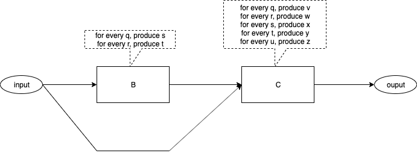
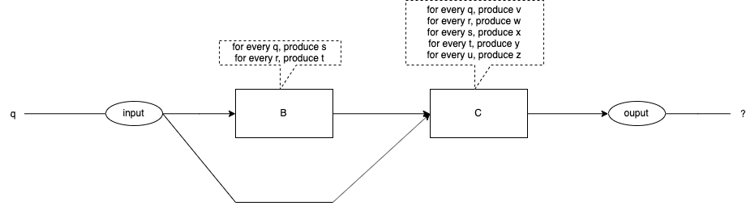
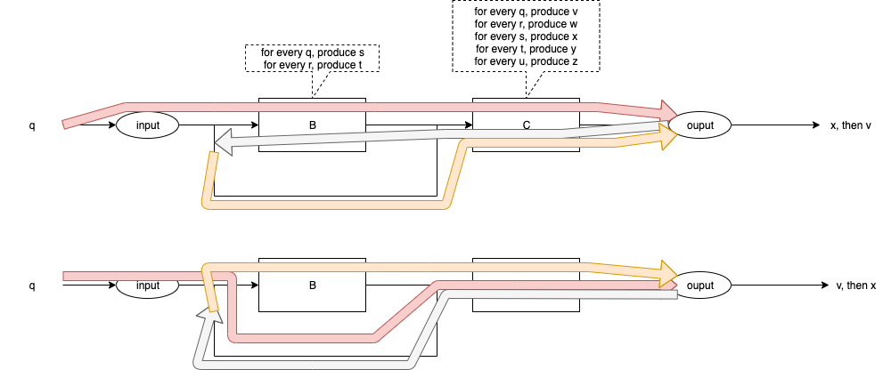
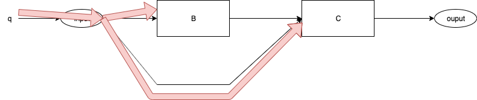
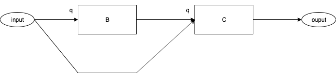
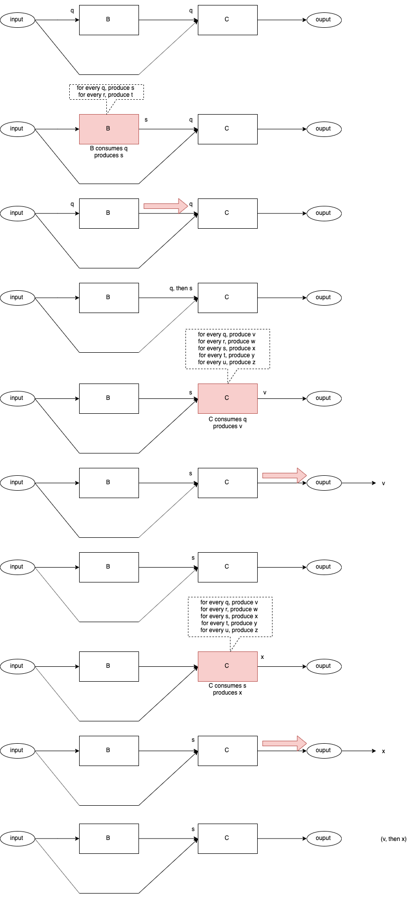
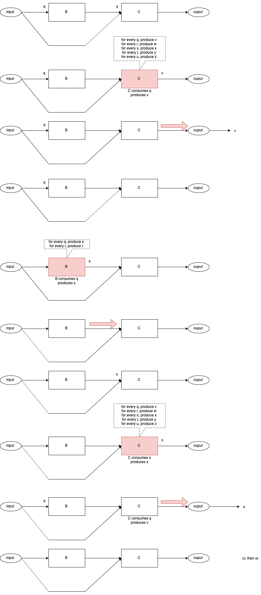

# Call Return Spaghetti

## Introduction #

In this essay, I show that a diagram of a Call/Return system makes less sense than a diagram of a concurrent system.

I show the fundamental operation of a concurrent system and argue that it is inherently simpler than a system based on Call/Return.

## Simple System #

Fig. 1 contains a diagram of a simple system.




The diagram contains one input[^crs1] port and one output[^crs2] port.

The diagram contains two components[^crs3].  The algorithms for the boxes are straight-forward[^crs4].  The algorithms are stated in terms of what each box outputs when inputs arrive at that box.

The flow of data within the diagram is shown by arrows.[^crs5]

It appears that we have plugged two software components together to form a system.

## What Happens? #

What Happens When Events Arrive?




What happens when an event arrives at the input?  See Fig. 2.

The event, "q", is injected into the input.

The algorithms specify exactly what each box does for any given input.

What is the expected output?

Do we see the expected output every time?

Do we see the expected output for every coding of the diagram?

## Current State of the Art #

### The Code for Components B and C

We can implement the diagram in pseudo-code.

#### Function B

```
function B(in) {
  if (in == q) {
    call C(s)
} else if (in == r) {
    call C(t)
} else {
  FatalError()
}
```
Fig. 3 Function B

#### Function C
```
function C(in) {
  if (in == q) {
    output <- v
 } else if (in == r) {
    output <- w
 } else if (in == s) {
    output <- x
 } else if (in == t) {
    output <- y
 } else if (in == u) {
    output <- z
} else {
   FatalError ()
}
```
Fig. 4 Function C

### Code Version 1

Version 1 of the code might call component B first:

```
main () {
  call B(q)
  call C(q)
}
```
Fig. 1 Code Version 1

### Code Version 2

Version 2 of the code might call C first:

```
main () {
  call C(q)
  call B(q)
 }
 ```
Fig. 1 Code Version 2

### Final Output

Final Output
The final output of the preceding routines depends on which version of the code we use.

Version 1 results in the following code path:

```
main {
 call B(q)
   B calls C(s)
     output <-- x
   C returns to B
  B returns to main
 call C(q)
    output <-- v
    C returns to main
}
main done
```
Fig. 1 Final Output for Version 1

The final output for Version 1 is x,v[^crs6].

While version 2 results in the following code path:

```
main () {
  call C(q)
    output <-- v
  call B(q)
    B calls C(s)
      output <- x
      C returns to B
    B returns to main
}
main done
```
Fig. 1 Final Output for Version 2

The final output for Version 2 if v,x.

Version 1 and version 2 create different results.


### Control Flow

Fig. 5 shows the control flows for code versions 1 and 2.



## The Desired Outcome


We want to plug software components together.[^crs7]

We want the diagram(s) to mean exactly one thing.

We want the diagram(s) to mean the same thing every time.

This is possible.

I will show the event flow that we desire, in a series of diagrams, then, I will discuss how this flow can be achieved[^crs8].

### Event Delivery 1



Fig. 5 shows event "q" being delivered to B and C.

Nothing else happens, no routines are called.

### After Event Delivery 1



Fig. 5 shows what the system looks like after Event Delivery 1 has occurred.

Both, Components B and C have an event "q" at their inputs.

(Neither Component has acted yet).

### Two Possible Control Flow Paths

At this point, two control flow paths are possible:

1. Component B runs first.
2. Component C runs first.

I will draw a sequence of diagrams for each path.

#### B Runs First - Path BC

{height: 90%}


#### C Runs First - Path CB

{height: 90%}



### Final Result

In both cases, Path BC and Path CB, the final result is the same - v is output first, then x is output.

### Achieving the Desired Result

#### Requirements

- All Components have an input queue, onto which incoming events are placed.[^crs9]
- Components cannot call one another.
- Components are asynchronous.
- A Dispatcher routine decides which Component will run and in what order[^crs10].
- Components are ready if they have events in their input queues.
- Components consume one input event and produce as many output events[^crs11] as necessary in reaction to the input event.
- Components perform a co-routine[^crs12] dance with the Dispatcher.  When a Component has processed a single event to completion, the the Component yields to the Dispatcher.  The Dispatcher decides which Component will run next.[^crs13] Components do not decide on the order of dispatching (as with call-return based code) nor can Components rely on any certain dispatching order.[^crs14]
- Events and data contained in events, are immutable.
- If a Component sends one event to multiple receivers, it must lock the routing wire.[^crs15]


In addition,

- Components have no parameters,  Send()[^crs16] is used instead.
- Components have no return values.  Send() is used instead.
- There is no syntax for exceptions[^crs17].  Send() is used instead.

#### Using Threads

Operating system threads[^crs18] can be used to trivially implement components.

Each Component has a mailbox[^crs19] and it sends messages to it parent[^crs20].  The parent routes the messages to the mailboxes of appropriate receivers[^crs21].

Note - using threads is overkill.  An operating system based thread involves hardware MMUs[^crs22] and separate stacks.  Operating system threads implement the out-dated notion of time-sharing.  None of these are actually required to make this system work.

##### Fairness

Fairness is not an issue.

Components run a single incoming event to completion, they yield only to the Dispatcher.

This system mimics, more closely, the modern ideas of distributed systems[^crs23].

##### Thread Safety

Thread Safety is not an issue.

Components cannot share memory, hence, thread safety is not an issue.

##### Shared Memory

Shared memory is not an issue.

Components cannot share memory.

Components can only send immutable messages.

In very tightly coupled systems, we have the temptation to send pointers to large blobs of memory.  The sender might mutate the blobs of memory before the message is read by the receiver.  

This system makes no guarantees for such situations.

This system[^crs24] gives the Architect all of the atomic tools necessary to create systems that work.  For example, the memory-sharing issue was encountered 40+ years ago in TTL-based hardware systems.  The solution was to use "double-buffering" and "overrun" flags.  If a system could not switch between buffers quickly enough, then it created an overrun condition.  A system which encountered overrun was deemed simply to be "too slow".  

The Architect must make the calculation[^crs25] of whether his/her design is "fast enough" for a given purpose.

##### Priority Inversion

Priority inversion is not an issue.

I don't use[^crs26], nor specify priorities[^crs27], hence, priority inversion cannot happen.[^crs28]

##### Loops and Recursion

It turns out that Looping (and Recursion) is the exception, not the rule.

Components must not enter long-running loops (or deep recursion).  Components must yield to the Dispatcher.  Note that compilers could insert yields at the bottom of Loops to accomplish this behaviour.

The Dispatcher routine is the only routine in the system that runs a loop.  It loops through a list of ready closures and, randomly, invokes a ready closure.  When the closure finishes[^crs29], the Dispatcher simply picks another ready closure to run.

##### Dynamic Routing

Dynamic routing is not an issue, because it's not supported.

Dynamic routing used to be called self-modifying code.  Self modifying code is a bad idea.[^crs30]

#### Using Closures

Most modern languages provide the concept of closures.[^crs31]  Closures might be called anonymous functions, or callbacks, or be embedded in concepts such as futures, etc.

Even C has a way to make closures, using function pointers.

The minimum closure required by this system requires some static, but not exported, data, and a temporary stack[^crs32].  N.B. one stack, for the complete system, is enough[^crs33].

OO[^crs34] Objects and Blocks are very close, in principle, to the ideas expressed here.  The difference is that I specify closures that run asynchronously whereas OO uses Objects that perform synchronous call-return and explicit naming of receivers.  I recommend that closures send messages to their parents and do not refer to each other directly.

In my opinion, and experience, creating separate stacks for each closure and using MMUs is overkill.  I don't wish to use time-sharing in my programs.  I might use time-sharing if I were to build an operating system.[^crs35]

If one imagines that closures contain state-machines, then, this method could be considered to be a system of communicating state machines.   I think in terms of clockwork[^crs36].

#### Other Features

##### Reuse

This system emphasizes reuse of Architecture[^crs37].

Architecture reuse is more valuable than code reuse.

##### Refactoring

Software Component Architectures composed in this manner can be easily refactored into other Architectures, simply by moving/deleting/adding arrows.

Components SEND() messages to their parents. Parents contain the routing tables[^crs38].  Parents route messages between their children.  This combination makes refactoring of Architectures easy[^crs39].

##### Isolation

This system produces a natural hierarchical composition of Architectures.

Parents route messages between their children.

Parents act like Components in all other respects.  Parents cannot SEND() messages to their peers.  They can only SEND() messages upwards to their parents, and route messages of their direct children.

###### Global Variables

Global variables are not an issue.

Global variables cannot leak beyond the boundaries of their Components.

Global variables are not a problem, if properly encapsulated.

###### Global Types

Global Types in synchronous languages are just as bad as Global Variables in those languages.

Global anything is bad.

Encapsulation must be applied to every concept in software architecture.

###### Namespaces

A component has two external namespaces:

- The set of inputs.
- The set of outputs[^crs40].

The internal namespace(s) of Components does not leak out.

All input names must be unique within the input namespace.

All output names must be unique within the output namespace.

The same name may appear in, both, the input and output namespaces.

Namespaces are naturally encapsulated in a hierarchical manner, due to hierarchical encapsulation of Components.

If two Components have exactly the same input namespace and the same output namespace, then the components are considered to be interchangeable, and "pin compatible".[^crs41]

###### Isolation of Control Flow

Control Flow within Components is naturally isolated by the fact that Components are truly asynchronous.

Control flow begins when a Component is invoked, and, control flow ends when the Component yields to the Dispatcher.

Control Flow does not leak beyond the boundaries of Components[^crs42].


[^crs1]: The oval labelled "input".

[^crs2]: The oval labelled "output".

[^crs3]: Boxes labelled B and C.

[^crs4]: See the dashed callouts pointing to each box.

[^crs5]: The input flows to B and to C.  B's output flows to C.  C's output flows to the output.

[^crs6]: in left to right order

[^crs7]: After all, computer (digital) hardware is plugged together.

[^crs8]: Even on synchronous operating systems.

[^crs9]: In a production version, Components also have output queues.  That requirement is a fine point, discussed elsewhere.

[^crs10]: The order is arbitrary.  Components are fully asynchronous.

[^crs11]: 0 or more.  In this example, each component produces exactly 1 output for each input, but this is not a requirement.

[^crs12]: FYI - This is easy to accomplish using closures and state-machine mentality.  Discussed later.  It is also easy to accomplish using threads, albeit this is overkill.

[^crs13]: There are many scheduling possibilities.  For example, the Dispatcher may invoke a Component repeatedly until the Component's input queue is empty.  Or, the Dispatcher may choose to work in a round-robin fashion.  Fairness is not an issue (since a Component will eventually go idle when its input queue is empty).

[^crs14]: Components are truly asynchronous and must survive through any dispatching order.

[^crs15]: In practical systems, this is not an issue.  It becomes an issue for bare metal systems (no operating system) or systems where Components are distributed along "very slow" connections.  I leave this "problem" to the Architect to solve in a manner suitable for the application.  I simply want to give the Architect the tools to work with to build reliable systems.  The Architect makes guarantees of reliability.  This system provides only the bare minimum tool set.

[^crs16]: SEND() is the only mechanism for transferring data.  Data can be transferred to any number of receivers up and down the line, using SEND().  There is no need for a specialized RETURN() expression.

[^crs17]: SEND() is the only mechanism for transferring data.  Exceptions are simply data.  Data can be transferred to any receiver using SEND().

[^crs18]: a.k.a. processes

[^crs19]: a.k.a. input queue

[^crs20]: which I call a schematic

[^crs21]: The routing information is based on the arrows on the diagram(s).

[^crs22]: Memory Management Units

[^crs23]: e.g. IoT, multi-core and internet systems

[^crs24]: We call it Arrowgrams.

[^crs25]: Calculation is discussed elsewhere.

[^crs26]: This is not a flippant statement, regardless of how it sounds.  It is based on hard-won experience with real products.  Priorities can (almost) always be designed out of a system.

[^crs27]: This is system of atomic tools.  Priorities are non-atomic and can be implemented using the atomic tools.

[^crs28]: If a system must act using priorities, then the Architect is referred to literature on hardware priorities⁠1 fully documented some 40+ years ago.
	1 NMI and IRQ levels.

[^crs29]: e.g. executes a RETURN

[^crs30]: Self-modifying code is especially bad from the maintenance perspective.

[^crs31]: Closures were explored in the 1950's using Lisp.

[^crs32]: A temporary stack is used for compiler-generated temporary values.

[^crs33]: One stack is needed for implemenationon von Neumann architectures.  Maybe one stack is one too many in non-von Neumann architectures?

[^crs34]: Object Oriented

[^crs35]: I argue that we shouldn't use operating systems at all.

[^crs36]: Rendezvous techniques also form clockwork systems.  Rendezvous has the drawback that it imposes synchronous operation of processes.  This is anathema to concurrency.  In a concurrent system, processes are asynchronous by default.  Synchronization is the exception not the rule.  If synchronization is needed, it must be explicitly designed (for example, see ACK/NAK protocols in networking, and, synchronization techniques used in TTL hardware of the 1980's).

[^crs37]: Reuse can be performed by cut/copy/paste.  According to Paul Bassett, OO does not provide reuse.  OO provides multiple-use (which leads to parameterization, which leads to accidental complexities, and so on).

[^crs38]: a.k.a. arrows

[^crs39]: Routing tables is nothing more than indirection.  It also allows for reuse (as opposed to multiple use) of architectures.

[^crs40]: I call them "input pins" and "output pins", resp., inspired by TTL hardware concepts.

[^crs41]: This is similar to referential transparency, but, without the constraint that pin-compatible components must produce the same outputs (this loosening of the same-output restriction allows upgrading).

[^crs42]: Control Flow cannot leak because Components cannot CALL other components.  Components can only SEND() messages upwards to their parents for routing.  Corollary: the direction of SEND() is vertical-only - SEND() cannot be used to deliver messages sideways to peer components.  Components can SEND() data upwards to their parent.  A parent can route messages between children (and their own input and output pins).  Parents can SEND() commands downwards to children.
