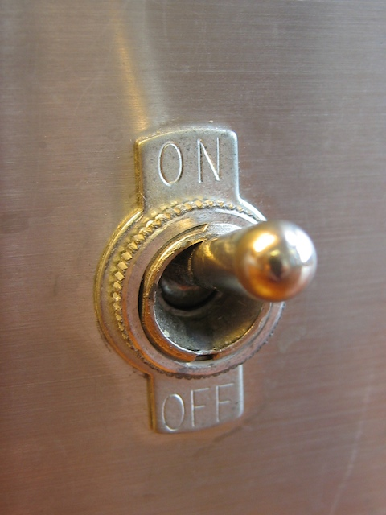

# Programming Is Not Coding
## An Abbreviated History of Programming Languages.

The ground truth is *programming*, not *coding*.

The goal of programming is to control a machine.

A secondary goal of programming is to make it possible to change a program easily, or, to steal parts of a program and use them in other programs.

A tertiary goal of programming is to buff and polish specific notations, like textual programming languages.

Buffing and polishing code notations is a sub-goal of programming, and is, therefore, not as important as the main goal: controlling a machine. Coding - writing textual scripts in a programming language - is but a subset of the main goal.

## What is the point of programming?
To control a machine.

To accurately break down an action in steps so small that even a machine can perform the steps.

Current electronic machines provide us with a set of steps called "opcodes".

## Early Machines

Early machines were mechanical.

Early machines used gears and pulleys.

## High Level Electronic Machines

Electronic machines - called *computers* - are machines where the gears and pulleys are replaced by electronics.

## Early Programming of Computers

### Tools
The earliest tools for programming computers were soldering Irons.

### IDEs
The earliest IDEs - Integrated Development Environments - for programming computers were soldering stations which included a desk, a static mat, soldering iron, solder, resin and optionally, amenities like magnifying glasses, desk lamps, etc.

### Process
Changing a program, consisted of unsoldering wires and connecting them elsewhere.

### Drawbacks
The primitive programming tools and IDE were slow, but, orders of magnitude faster than changing the behaviour of machines by pulling gears and replacing them with other gears.

Other drawbacks included blisters on fingers.  Recently soldered nodes would remain hot for a while and would create blisters if touched too soon.

##  Toggle Switches (Advanced Programming)

Toggle switches were used to replace soldering of wires.[^jz]

{width: 40%}

[^jz]:Jason Zack at en.wikipedia, CC BY-SA 2.5 <https://creativecommons.org/licenses/by-sa/2.5>, via Wikimedia Commons

Revelation: toggle switches had 2 states "OFF" and "ON".

Revelation: arranging toggle switches in sequential and parallel combinations produced physical equivalents of Boolean Logic (AND and OR functionality).

## Breadboards (Advanced Programming)

Breadboards were used to allow moving and reconnecting wires without the need to solder.[^pengxh]

{width: "70%"}

[^pengxh]: https://commons.wikimedia.org/wiki/File:Breadboard_in_our_experiment.jpg

This was faster than programming by soldering, but, it was more expensive.

## Miniaturization (Super Advanced Programming)

Switches were miniaturized down to the size of dust particles.[^zephyris]

{width: "60%"}

[^zephyris]: https://commons.wikimedia.org/wiki/File:Microchips.jpg

### Drawback - Dust
The main drawback of miniaturization is that dust particles interfere with and block operation of switches when switches are that small.

The solution to this problem is to use clean rooms.  Clean rooms keep dust out when making very small switches.[^duk]

{width: "70%"}

[^duk]: https://commons.wikimedia.org/wiki/File:Clean_room.jpg

### Drawback - \$\$\$
The drawback of using clean rooms and miniaturization is that they are very expensive.

Only a few startups could afford to pay for clean rooms, e.g. Motorola, Fairchild, National Semiconductor, Texas Instruments, Mitel, etc.

## HCI - Human Computer Interfaces - Keyboards and Displays

Problem #1: Ultra-small switches were too small for humans to interact with.

Problem #2: Ultra-small switches produced results that consisted of electrical impulses.  The human body does not have precision sensors for detecting tiny electrical impulses.

### Solution - Keyboards
Invent human-sized banks of switches - called QWERTY keyboards.[^mb]

{width: "60%"}

[^mb]: https://commons.wikimedia.org/wiki/File:Qwerty_Keyboard.JPG

### Solution - Displays

Invent mapping from tiny electrical impulses to larger, human-sized displaying units.[^vt100]

{width: "60%"}

[^vt100]:https://commons.wikimedia.org/wiki/File:Vt100-adventure.jpg
Printers (display results on paper).

Video screens.  Display results on thin films of phosophorous painted onto the backside of glass tubes.

LED screens. Display results on grids of tiny light bulbs, called light emitting diodes.

Teletypes: Combination of printer and QWERTY keyboard as single units.[^tty]

{width: "60%"}

[^tty]:https://upload.wikimedia.org/wikipedia/commons/9/9e/Teletype.jpg
