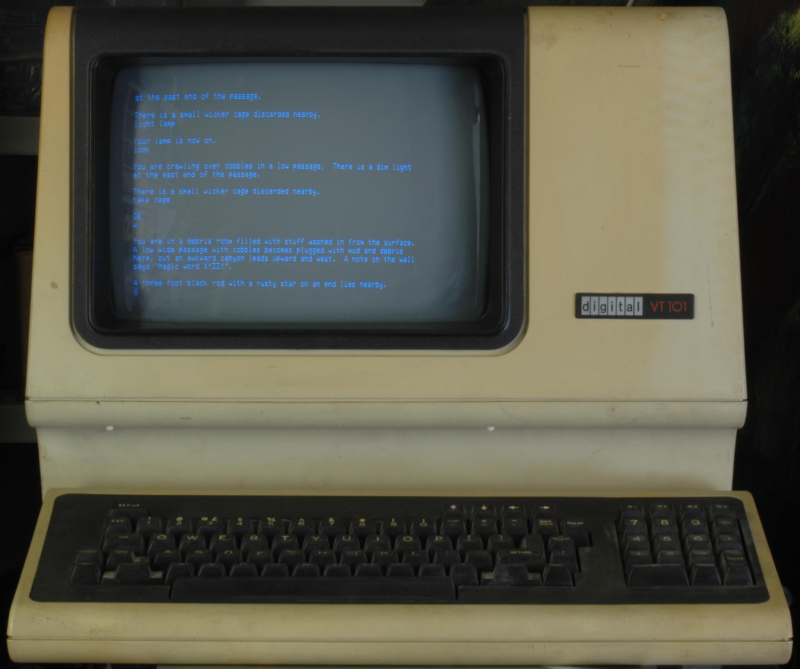

# Programming Is Not Coding
## An Abbreviated History of Programming Languages.


The ground truth is *programming*, not *coding*.

The goal of programming is to control a machine.

A secondary goal of programming is to make it possible to change a program easily, or, to steal parts of a program and use them in other programs.

A tertiary goal of programming is to buff and polish specific notations, like textual programming languages.

Buffing and polishing code notations is a sub-goal of programming, and is, therefore, not as important as the main goal: controlling a machine. Coding - writing textual scripts in a programming language - is but a subset of the main goal.

## What is the point of programming?
To control a machine.

To accurately break down an action in steps so small that even a machine can perform the steps.

Current electronic machines provide us with a set of steps called "opcodes".

## Early Machines

Early machines were mechanical.

Early machines used gears and pulleys.

## High Level Electronic Machines

Electronic machines - called *computers* - are machines where the gears and pulleys are replaced by electronics.


## Early Programming of Computers


### Tools
The earliest tools for programming computers were soldering Irons.

### IDEs
The earliest IDEs - Integrated Development Environments - for programming computers were soldering stations which included a desk, a static mat, soldering iron, solder, resin and optionally, amenities like magnifying glasses, desk lamps, etc.

### Process
Changing a program, consisted of unsoldering wires and connecting them elsewhere.

### Drawbacks
The primitive programming tools and IDE were slow, but, orders of magnitude faster than changing the behaviour of machines by pulling gears and replacing them with other gears.

Other drawbacks included blisters on fingers.  Recently soldered nodes would remain hot for a while and would create blisters if touched too soon.


##  Toggle Switches (Advanced Programming)


Toggle switches were used to replace soldering of wires.[^jz]

{width: 40%}


[^jz]:Jason Zack at en.wikipedia, CC BY-SA 2.5 <https://creativecommons.org/licenses/by-sa/2.5>, via Wikimedia Commons

Revelation: toggle switches had 2 states "OFF" and "ON".

Revelation: arranging toggle switches in sequential and parallel combinations produced physical equivalents of Boolean Logic (AND and OR functionality).


## Breadboards (Advanced Programming)


Breadboards were used to allow moving and reconnecting wires without the need to solder.[^pengxh]

{width: "70%"}


[^pengxh]: https://commons.wikimedia.org/wiki/File:Breadboard_in_our_experiment.jpg

This was faster than programming by soldering, but, it was more expensive.


## Miniaturization (Super Advanced Programming)


Switches were miniaturized down to the size of dust particles.[^zephyris]

{width: "60%"}


[^zephyris]: https://commons.wikimedia.org/wiki/File:Microchips.jpg

### Drawback - Dust
The main drawback of miniaturization is that dust particles interfere with and block operation of switches when switches are that small.

The solution to this problem is to use clean rooms.  Clean rooms keep dust out when making very small switches.[^duk]

{width: "70%"}


[^duk]: https://commons.wikimedia.org/wiki/File:Clean_room.jpg

### Drawback - \$\$\$
The drawback of using clean rooms and miniaturization is that they are very expensive.

Only a few startups could afford to pay for clean rooms, e.g. Motorola, Fairchild, National Semiconductor, Texas Instruments, Mitel, etc.


## HCI - Human Computer Interfaces - Keyboards and Displays


Problem #1: Ultra-small switches were too small for humans to interact with.

Problem #2: Ultra-small switches produced results that consisted of electrical impulses.  The human body does not have precision sensors for detecting tiny electrical impulses.


### Solution - Keyboards
Invent human-sized banks of switches - called QWERTY keyboards.[^mb]

{width: "60%"}


[^mb]: https://commons.wikimedia.org/wiki/File:Qwerty_Keyboard.JPG

### Solution - Displays

Invent mapping from tiny electrical impulses to larger, human-sized displaying units.[^vt100]

{width: "60%"}



[^vt100]:https://commons.wikimedia.org/wiki/File:Vt100-adventure.jpg
Printers (display results on paper).

Video screens.  Display results on thin films of phosophorous painted onto the backside of glass tubes.

LED screens. Display results on grids of tiny light bulbs, called light emitting diodes.

Teletypes: Combination of printer and QWERTY keyboard as single units.[^tty]

{width: "60%"}


[^tty]:https://upload.wikimedia.org/wikipedia/commons/9/9e/Teletype.jpg

## Assembler (Ultra Advanced Programming)

Revelation: strings of bytes (e.g. ASCII) could be "parsed" to convert mnemonic words into binary opcodes.

For example, the string "RET" could be pattern-matched and replaced by the hex byte 0xC9.  This process mapped the 3-byte sequence
```
0x52
0x45
0x54
```

to the 1-byte sequence:
```
0xC9
```

Revelation: "RET" and "RETX" were parsed the same if a shortest match strategy was used.  The fix was to use a longest match strategy and make certain characters special. Whitespace was used to mark the end of any word. We call such special characters *delimiters*.  This led to the concept that whitespace is not allowed in mnemonic words. Note, that whitespace is used in prose, but is disallowed in programming languages.  A phrase in prose consists of several words separated by whitespace, whereas a phrase in a programming language is composed of syntactic constructs, like `if then else`, using words that contain no whitespace.

So, the 3-byte sequence, above, became a 4-byte sequence[^space]
```
0x52
0x45
0x54
0x20
```

[^space]:FYI - 0x20 is ASCII for "Space".  Practically, "Tab" - 0x09 - was used more often for cave-man-level pretty-printing purposes, but, still mapped to the same 1-byte sequence:
```
0xC9
```
It was discovered that *operands* of opcodes could, also, be parsed in similar ways. Comma was treated as a sub-class of delimiters:
```
MOV R0,(R7)+
```
Note that assembler used 2 very important, but subtle, tricks:
1. separation of operators and operands 
2. line-oriented

Both of these tricks make it easier to write programs that write programs. Tricks such as these led to invention of apps call 'compilers'.

### Separation of operators and operands
This is what is called "orthogonal code" and is espoused in Cordy's thesis[^ocg].

The "orthogonal code" technique is familiar to most programmers in the form of the *gcc* compiler.  An early form of orthogonal coding was Fraser/Davidson's Peephole technology[^rtl].

*GCC* uses orthogonal code techniques first, then optimizes the generated code using techniques that are described in the Dragon Book[^dragonbook] to generate assembler code that rivals assembler code written manually by human assembler programmers.  *GCC* is so good, that just about no-one bothers to write assembler any more.  At first, the concept of using compilers was thought to be too inefficient to be practical, and, was laughed at.  *GCC* changed such ideas.

[^dragonbook]: https://en.wikipedia.org/wiki/Principles_of_Compiler_Design (revised https://en.wikipedia.org/wiki/Compilers:_Principles,_Techniques,_and_Tools)

Unfortunately, the orthogonal programming technique has been ignored in the development of most programming languages.

Programming languages *could* be categorized as:
- operation phrases
- operands.

But, programming language designers fell under the spell of "one language to rule them all" and conflated control flow (operation phrases) with operands.

OOP (Object Oriented Programming) is a description of *operands* and could be used effectively in an orthogonal programming language.

## Line-Oriented Source Code
Another "trick" that helps in writing programs that write programs is the use of normalization.

One form of normalization is the idea of using lines of text to delimit programming phrases.

For example:
```
MOV R0,(R7)+
MOV R1,(R7)+
```
Is pattern-matched as 2 separate lines.  This "trick" makes pattern-matching easier.

"Easier" is a subjective term and a psychological trick.  If a technique is "easy enough", it will be used, and, become an idiom, and, will relieve the minds of smart people to think about more lofty problems.

Line-oriented assembly code was so "easy" to automate that it allowed programmers to invent higher-level programming languages, and, compilers, and, interpreters.

"Compilers" are simply "apps" directed at programmers.  Compilers stand on the shoulders of other apps-for-programmers, like assemblers.

#### UNIX Shell Pipelines - Line-Oriented
A shining example of line-oriented source code being used to create bigger and better programs is the UNIX shell and *pipelines*.

The UNIX shell hard-wired the notion of *lines of text* into its structure. 

A slate of tools emerged from this simple, subtle assumption.  Tools like *grep*, *REGEX*, *sed*, *awk*, etc.

Programming languages have evolved into using a *structured* syntax, where programming phrases (like `if then else`) cross line boundaries and are recursive.

The UNIX assumption of *everything is a line* is not good enough to handle most modern languages.  Lines are not recursive, where the syntax of textual programming languages is recursive.

### Aside - Tree-Oriented Source Code
A different approach to parsing is found in the language Lisp.

In Lisp, all source code is structured in the form of trees.  Lisp uses the concept of *list*s. Lisp source code is written in the form of *parse tree*s made from *list*s.  A unit of source - a Lisp function call - is a list (instead of a line) in a very rigid structure.  First, comes the name of the function, and the rest of the list (if any) contains the arguments to the function.  This format is often called Reverse Polish Notation[^rpn].

Like line-oriented assembler, this normalized structure makes it "easy" to write code that writes code.  Lisp notation led to the notion of *macros*[^cmacros].  Lisp macros are essentially code generators.

Unlike line-oriented assembler, the lisp list structure is recursive and can be used to write code that contains other code, i.e. functions that call functions that call functions, and so on.

[^cmacros]: Lisp macros are much more powerful that what is thought of as macros in other languages, like C.  Lisp macros are like plug-ins.  Lisp macros are functions that modify the operation of the Lisp compiler and interpreter.  Lisp macros are functions that run at compile-time.

[^rpn]: In fact, there is nothing "reverse" about this notation, it is a prefix notation.


##  High Level Languages (Super Ultra Advanced Programming)


The ease of writing programs that write programs led to the invention of bigger and better programming languages and compilers.

All programming languages devolve to assembler in the end, e.g. Haskell is converted into assembler by the Haskell compiler, Rust is converted into assembler by the Rust compiler, C++ is converted to assembler by the C++ compiler, and so on.

HLL - high level language - compilers are simply skins that make it more convenient for programmers to create assembler code.  The machine - the computer - doesn't care how the assembler is created, it simply executes instructions given to it.

Programmers, though, want helper apps to help them catch bugs more easily.

Programming languages as text were invented to alleviate programming problems.  The problems were perceive because of 1950's based biases and realities.  At the time, CPUs were expensive and rare and memory was expensive.  The majority of solutions to these problems included
- time-sharing (using 1 CPU to run many apps)
- GC - garbage collection - recycling memory
- mutation - recycling memory
- the call-stack was invented based on the notion that computers were simply bigger and better calculators ; this attitude implied that mathematics notation is "good enough" for programming computers
- prioritizing optimization of CPU effort over human-developer effort. In 2022++, CPUs are abundant and cheap, and memory is abundant and cheap, yet, programmers continue to use techniques developed to solve perceived problems of the 1950s. In 1950, we had Central Processing Units, in 2022++ we have Distributed electronic machines.
- Syntax checking - parsing - was invented to ensure that strings of non-whitespace characters were arranged in a sensible order that could be automatically transpiled into assembler (using compilers)
- Type checking was originally invented to optimize app speed on CPUs.  CPUs could handle certain kinds of numbers faster than other kinds of numbers.  For example, numbers that were integers in the range of -128..127 could fit in a byte, whereas floating point numbers needed to be represented using more bytes.  Byte-oriented integers were often handled directly by the CPU hardware, whereas floating point numbers could only be manipulated using libraries of code.  Calling library routines was much, much slower than using built-in CPU integer operations.

Once the menial tasks of low-level optimization were lifted from programmers' shoulders, it became possible to invent user-defined types and deeper type-checking of user-defined types.

Many "new" programming language designs add more developer debugging help in the form of incrementally better/deeper type-checking.

Various helper-apps for programmers were developed and are still being developed, such as
- syntax checking
- type checking
- IDEs

### ASCII
The original programming languages had only numbers because those could be conveniently expressed in mathematical notation.  For example, there was no concept of character strings.  Strings were treated simply as arrays of byte-sized numbers.  

ASCII (and EBCDIC) were invented to encode characters using small (byte) integer codes.  

Programming languages were defined using this restricted encoding.  For example, strings 
use the same character `"` to mark string beginnings and string ends.  This choice is contrary to any sensible encoding and contradicts the concept of quotes used in written natural languages.  This encoding makes it harder to parse strings and leads to epicycles involving multi-line strings and strings that contain quotes.

Since then, Unicode was invented.  Unicode greatly expanded the range of possible integer codes that could be used to represent characters, yet, we continue to design languages with work-causing, bloat-causing assumptions from the 1950s.  Programming languages could use different characters to demarcate beginnings and ends of strings, but, don't.

The drive to satisfy 1950s biases, such as ASCII, cut off development of alternate syntaxes, like diagrams and glyphs.  At one point the language APL was popular but required special keyboards and displays and required that all text be written in upper case.

Early languages, like FORTRAN and LISP cut out the use of lower case letters.  In part, this helped to "improve efficiency" of parsing (ASCII lower-case "a" differs from upper-case "A" by one bit, allowing succinct assembler tricks to be used).  In part, this was an admission that programming languages were not the same as natural languages.  It seemed reasonable to "program a computer" by using commands written only in upper case.  We continue to see repercussions of this decision even today.  File names are schizophrenic - Linux treats file name case as significant, whereas MacOS ignores case in file names.  This non-standardized disparity leads to surprises even in 2022++.

### Code Bloat
Code in 2022++ is orders-of-magnitude larger than code in early computers.

Functional programming is fundamentally small and beautiful.  Sector Lisp is a shining example of just how small programming languages can be made to be.  Sector Lisp is less than 512 bytes[sic]  in size.  Sector Lisp's Garbage Collector is 40 bytes[sic] long.

At first, one assumes that Sector Lisp's smallness is only due to assembler tricks and avoidance of the inherent complexity of programming problems.

This is but a hand-waving argument that is used to ignore much deeper issues.

#### Assembler Tricks
If Sector Lisp's smallness was due only to assembler tricks, we would expect to see the *gcc* effect.  Someone would have built compilers for most existing languages that produced orders-of-magnitude less assembler code than existing compilers are capable of producing.

This hasn't happened.

Programming languages produce bloated and large assembler code for reasons that go beyond simple application of assembler tricks.

#### Complexity
No concept is complicated.

Complication is only in the eyes of the beholders, i.e. complication is due to the use of unsuitable notations for expressing and solving specific problems.

When a  concept appears to be complicated, it is because an inappropriate notation is being used to describe the concept.  Apparent complication arises when too many concepts are force-fitted into a single notation.

The simple concept of *functional programming* has, at its core, a few fundamental principles:
- immutability
- stack-oriented evaluation
- function calls that are instantaneous
- lambdas as stack-based wrappers

##### Immutability - Referential Transparency
Immutability is vital to "referential transparency" in functional programming.

Referential transparency means being able to replace a unit of code, e.g. a function, by another unit of code.  In hardware, this is called "pin compatible".

Microsoft Word's *Find and Replace* function is a form of referential transparency.  It replaces one string of characters with another string of characters.  Some rules must be followed to allow this feature to work without creating surprises.  Referential Transparency applied to programming languages, also, requires a set of rules.  The rules are very similar to the rules for using *Find and Replace*.

There is more than one way to achieve Referential Transparency. 

The method used in hardware is to elide the insides of components, using black epoxy and plastic, and, to characterize components "from the outside" so that components can be compared and suitable substitutions can be made. 

In functional programming, Referential Transparency is achieved by decreeing that mutation cannot happen *anywhere* in the codebase.

Computers, though,  inherently support mutation. RAM (Random Access Memory) implies mutation.

So, there's a disconnect between functional programming and the reality of computer hardware.

##### Stack-Oriented Evaluation
Function calls with parameters always cause the parameters to be evaluated before the function is called.

The results of parameter evaluation are placed in temporary locations on the call-stack.

##### Instantaneous Function Calls
Pure functional notation works only if function call latency can be ignored.

In reality, CPUs implement function calls in hardware using operations and a global call-stack.  

The operations CALL and RET take finite amounts of time when implemented in hardware.

This means that functional notation, while useful for some kinds of use-cases, is not able to express the full gamut of computer operations.

Programmers have force-fitted finite-time concepts into functional notation.  This has resulted in unexpected bugs (see Mars Pathfinder disaster[^mp]) and general agreement that certain kinds of programming constructs are "complicated".  For example, "concurrency" is considered to be a difficult problem, causing issues such as "thread safety", "preemption", etc.

[^mp]: https://www.rapitasystems.com/blog/what-really-happened-software-mars-pathfinder-spacecraft

Furthermore, the assumption of instantaneous function calls - on paper - conflicts with the reality that hardware CALL/RET instructions are forms of ad-hoc *blocking*.  On paper, a function can call[^call] another function instantaneously, whereas in hardware, a function call suspends the caller until the callee returns a value.  The callee needs a certain amount of time to complete, and, we cannot calculate that time without knowing exactly what other functions are called and what functions are called by those functions, etc.

[^call]: Note that the word *call* is not used for paper versions of the notation.  The term *call* was invented with respect to computer programming.

#### Code Bloat Due to a Plethora of Types
Sector Lisp gets some of its leanness due to the fact that - like McCarthy's original Lisp - Sector Lisp has only 2 types
1. Atom
2. List

A machine needs lots of detail, while humans want to elide detail.  Sector Lisp is a demonstration of how large the notational savings can be if detail is elided.  The 2-type system provided by Sector Lisp is good enough for controlling a machine.

It seems that we need languages at both extremes - many types vs. very few types - and, we need a way to map from one extreme to the other, or, in only one-way, to map from a human-amenable language to a machine-executable language.

In the past, it was considered difficult to build languages, so programming language designs attempted to straddle both extremes.

Today, in 2022++, technology such as Ohm-JS ("new and improved" PEG), it is possible to invent languages quickly (e.g in an afternoon).  It is possible to tune one language for human use and another completely separate language for machine use.  

We see the beginnings of this kind of separation in the Assembler vs. HLL split, but, due to the difficulty of inventing languages, the idea of inventing multiple languages has not been exploited.  In fact, biases against the use of multiple languages have developed, probably due to the inadequacy of the one-language-to-rule-them-all approach.  Existing languages are full of minute details and doo-dads which makes such languages hard to learn and makes the idea of using more than one language seem unfriendly.

The idea of inventing languages has, historically, been relegated to the field of compiler development.  The concept of light-weight macros and text-manipulation tools, like those of UNIX, has been overshadowed by 
- the fear of learning complicated new language syntaxes, which leads to the unsubstantiated fear of learning *any* new syntaxes
- the desire to flatten all layers of design into walls of details, and, the desire to "make the trains run on time", and, the desire to construct software in a clockwork manner.  All of which makes software development accessible only to a select few.

The "answer" to these problems is to turn the problems on their side and to look at them from a new perspective and to re-examine the problems from first principles.

The problem is that software components are too complicated.  The solution begins with understanding why the complication arises, not to work around the complication.  7-line[^7] BASIC programs were easy to understand and to develop.  Issues such as "global variables" don't even arise when program sources are that small.  The answer is not how to solve the problem of creating 8-line programs, but to how to bolt 7-line programs together, recursively in layers, so that no layer has more than 7 lines of code in it.  Even a very large system - usually thought to be "complicated" - consists of 7 lines of code at the top level.  We don't need to throw details away, we simply need to bury details.  Once the top layer is understood, the reader might wish to know more details.  More detail can be revealed by drilling down into sub-components and examing them (each of which contains no more than 7 lines of code).  The fact that very complicated A.I. machines can be controlled 5 line Python programs indicates that the goal of small programs can be achieved.

[^7]: https://en.wikipedia.org/wiki/The_Magical_Number_Seven,_Plus_or_Minus_Two

In this scenario, each layer must be totally indepedent from lower layers.  Each layer must be *understandable* in a stand-alone manner.  

From a first principles viewpoint, we see problems like
1. dependency, especially hidden dependency due to synchrony, causes a trickle-down effect that makes layers not understandable on their own, and, makes them appear to be complicated
2. inheritance instead of parental authority - child code can change the behaviour of parent code, making the parent code not-understandable on its own, even if it is only 7 lines long.

GC (Garbage Collection) without the presence of mutation is small and simple, as characterized by Sector Lisp's 40-byte[sic] garbage collector.

#### Code Bloat Due to Type Checking - The State Explosion Problem
Imagine a simple piece of code to add two numbers.
```
number add2numbers (number a, number f) {
  ...
}

void main_not_bloated () {
  number a;
  number f;
  number result;
  result = add2numbers (a, f);
}
```
Humans understand the concepts of numbers.  The numbers might be integers or they might be doubles or they might be bignums.

Machines, though, don't understand these differing concepts and need to be programmed to handle the various cases in various ways and efficiencies.

In some languages, data carries tags that describe the type of the data.

In other languages, the tags are pre-compiled out and removed before execution.  The process of removing type tags must be done with enough care to allow the machines to know how to manipulate the data.

At the machine level, we might wish to transform the above code to handle the various cases of numbers as integers vs. numbers as floats.
```

float add2if (int a, float f) {
  ...
}

float add2ii (int a, int f) {
  ...
}

float add2ff (float a, float f) {
  ...
}

float add2fi (float a, int f) {
  ...
}


void main_bloated () {
  int a;
  float f;
  float result;
  result = add2if (a, f);
}

```
The machine-level code grows exponentially larger as new kinds of numbers, with different details, are included.

This effect is called the State Explosion Problem.  The effect has traditionally been associated with the development of State Machines, but, as seen above, the effect creeps into other aspects of programming.

The problem becomes even worse when languages allow programmers to define new types.  This is usually called "user-defined types" and "classes".

Various ad-hoc attempts have been made to reduce this problem in one-size-fits-all languages:
- the use of functions to wrap and parameterize similar runs of code
- inlining
- generic types
- etc.

Many of these approaches have runtime implications.  For example, the use of functions to abstract code causes the runtime code to run slower (due, at least, to the use of CALL/RETURN opcodes).

A great amount of compile-time effort (burning CPU cycles) is required to compile away all runtime implications of these solutions.  Again, the CPU effort is expended only to aid developers by checking for errors[^errors].  The machine doesn't care about type systems and other complicated structures.

[^errors]: But, only errors that are expected by the programmer(s) who wrote the error-checking app.

What is the cost-benefit for such expended effort?  

Compiling away all remnants of type checking is only fruitful once the design is known to work and is stable.  This is, traditionally, called Production Engineering.

During Design, though, it is unnecessary to compile away all type checking, and, the extra time and effort in doing so causes interruptions in the design process. Design is done when the designer is "in the zone" (or "in flow").  Interrupting the flow can severly diminish the abilities of the designer, and, hurt the design.

Software development appears to be in the "cottage industry" phase, where one programmer[^group] does all of the above work - from Design to Production Engineering.

[^group]: Or, one team of programmers.

##### Details kill

Details kill understandability.

It is the Architect's responsibility to make a design clear and understandable to other readers.

### Types Needed During Design
To interfere as little as possible in the Design process, we need approximately two types:

- things
- recursive lists of things

Currently, developers use compiler-appeasement languages that insist on extreme amounts of detail to help compiler apps to check for errors.  Compiler-appeasement languages, though, impede the progress of product development, often in subtle ways, e.g. by breaking development "flow" by insisting on extreme amounts of detail[^save].

[^save]: As a simple example, any software tool that asks "where do you want me to save this?" up front, is asking the developer to stop developing to deal with information to satisfy the tool's problem.  Likewise, something like "which kind of mind-map do you want to build?" is a development-breaker.  Another deal-breaker is "declaration before use" which is a concept developed to appease 1950s biases.  Computer hardware in 2022++ is fast enough to perform multi-pass compilation, but, programming language designers continue to insist on 1950s-style declaration-before-use.

Error checkers like *lint* are more humane.  *lint* does not change the development programming language. *Lint* does its best to look for potential errors. *Lint* is like a barnacle attached to the side of a program.

Lisp introduced the concept of gradual typing, but, most modern languages insist on making programmers specify types fully. 

#### Code Bloat Due to Word Size
Building a compiler that was portable across two memory architectures - 8-bit and 16-bit - I measured code size for the same source program[^lost].

[^lost]: I've lost the actual supporting data over time.  I'm writing this from memory.

The 8-bit version was 40% the size of the 16-bit version.  I.E. the 16-bit version of the *same program* was more than twice the size of the 8-bit version.  That's greater than 100% inflation.

The reason for the size increase is that larger word sizes are not needed to encode all instructions nor operands.  Larger word sizes contain waste bits for instructions and operands that could be encoded more succinctly.

The trade-off involves memory fetching. Smaller word sizes need multiple fetch cycles to read large instructions and operands from memory.  In an 8-bit architecture, this means that the most efficient opcodes and operands are in the 0..255 range.  All other opcodes and operands take more time to read from memory.

Word size also affects internal circuitry - it takes less space in an IC to build circuits for handling 8-bit quantities than building the circuitry to handle the same quanities in 16-bit form.

Word size affects VLSI pinout.  CPU chips  typically have separate pins for each address line and for each data line. Connections inside a chip are very small, too small for handling by humans and early industrial machines.  Pins are used to bring electrical connections from inside a chip to the outside world.  Pins are little tabs of metal that are electrically connected to the points inside ICs.  In the 1970s, ICs were mostly assembled by humans wielding soldering irons and various other kinds of wiring technologies (like wire-wrapping).  With improvements in miniaturization, it was possible to shrink the size of pins while retaining the ability to assemble electric circuits using automated equipment (e.g. wave soldering) and humans wielding smaller-tipped soldering irons and magnifying glasses.

For a typical 8-bit architecture, like the 8080, Z80, MC6809, etc., the data bus consists of 8 pins and the address bus consists of 16 pins.  16-bit addresses are used in these specific architectures, but, this doesn't mean that all 8-bit machines use 16-bit addresses.  This is a total of 8+16 pins, ie. 24 pins to access RAM.  In fact, one or more extra pins are needed to manipulate the RAM (e.g. the Write line, a clock signal, power, etc.)

For 16-bit architectures, the pin count goes up.  For example, the data bus needs 16 pins and the address bus is expanded to 24 or 32 pins (40 and 48 external pins, respectively.)


## Other Syntaxes

Random comments about miscellaneous syntaxes / technologies ...

Programming doesn't have to mean text-only.  The goal is to control (use) a computer.  The goal is to generate instructions for the computer to follow.  Somehow.

### Spreadsheets
- Maybe the most successful non-programmer syntax is the spreadsheet.
- flat grid
- list of builtin functions
- simple set of rules
	- grid + palette of possible functions to use
	- no decisions to be made about using nor extending the technology
	- simple, uncomplicated, "simplicty is the lack of nuance"
	- grade-school math, simple equations
	- simple syntax for accessing cells - row, column - no need to remember names
	- future: instead of naming cells, show different views
	- e.g. dependencies on other cells
		- Racket-like lines
	- e.g. synonyms, e.g. \$A1\$B2 is, also, called "Total", also, called "Sum of Column (\$C3:\$C99)"
	- use hotkey to toggle between \$A1\$B2 syntax and synonyms
	- there is no "one language to rule them all", different users may want different names, allow switching via synonym toggling
	- synonyms can apply to code, too
		- "y = *slope* times *x* + *y offset*" is, also, "y = mx + b"
		- lambda functions are barking up this tree

### Relational Programming
- PROLOG
	- granddaddy of declarative programming
	- uses backtracking to perform exhaustive search
	- sneered at in 1950s, due to biases that favoured speed optimization
	- backtracking driven by desire to conserve memory
- miniKanren
	- does not use backtracking, but, also, implements exhaustive search
	- coagulates all possible outcomes and feeds set of outcomes forward
	- prunes outcomes that cannot happen from the set of possibilities
	- final result = set of all possible ways to satisfy a goal
	- not concerned with expending memory, hence, doesn't need to use backtracking
		- backtracking is difficult to implement
		- backtracking is difficult to understand
- what not how - declarative programming
	- Relational Programming splits problems into two parts 
		1. What
		2. How
		- What is specified by the human programmer
		- How is implemented in an engine, freeing the human to think about the larger problem instead of dealing with details

### Everything is a String
- Lisp treats everything as Lists, there are some languages that treat everything as strings
- SNOBOL
	- the granddaddy of string-based languages and string matching
- Icon
	- grew out of SNOBOL
- TCL/tk
	- TCL is a scripting language based on treating all data as strings of characters
	- tk is a library for creating graphical views on data that grew out of the ability to suppress details like how the data is actually structured (e.g. integers vs. strings, etc.)
		- the details are all still there, but are elided at the top level
		- the details are buried in the TCL engine
- Parsing
	- string-matching technology usually associated with compiler building
	- compilers are simply big transpiler apps
		- convert a string of characters into another string string of characters
		- high-level language text converted into assembler text (and/or to bits)
### Scripting
- like "everything is a string", but, includes files and redirection
- scripting is still *programming*, it uses scripts to control behaviour of computers
- example: /bin/sh
- example: emacs lisp
- example: cmd.exe
- often a "dynamic language" which punts typechecking to runtime

### Hypercard
- https://en.wikipedia.org/wiki/HyperCard
- https://hcsimulator.com

### Dataless Programming Languages
- dataless languages - don't require programmers to define data, just declare the existence of data
	- e.g. "handles" in operating systems
	- e.g. S/SL (Syntax/Semantic Language, Holt, et al) https://research.cs.queensu.ca/home/cordy/pub/downloads/ssl/
	- powerful enough for implementing compilers (e.g. PT Pascal, Concurrent Euclid, etc.)

### Concept: Orthogonal Programming Languages
- based on dataless languages, Cordy's Orthogonal Code Generator, and GCC's RTL
- OOP is 1/2 of the story
- control flow is the other 1/2
- data representation
	- Objects are often expressed as Classes with Methods
		- similar to mathematics concept of conditional functions
	- control flow is often expressed as *syntax*
		- syntax can, now, be quickly built using Ohm-JS (improved PEG)

### WASM
- Lisp-like syntax
- uniform syntax
- intended to replace JavaScript in websites
- intended to be "more efficient" than JavaScript
- attempt to add type information on operands and operators while using recursive assembler-like syntax

### VPLs
- StateCharts
		- StateCharts exhibit a lot of goodness
			- encapsulation
			- parental authority
			- diagrams instead of text for control-flow aspects
				- text can be used where it makes sense
		- reading of Harel's paper: https://guitarvydas.github.io/2020/12/09/StateCharts.html
- Scratch
	- ostensibly for children
	- hampered by synchronous mindset
	- https://scratch.mit.edu
- Full Metal Jacket
	- attempt at a pure functional visual syntax
	- https://www.fmjlang.co.uk/fmj/FMJ.html
- Drakon
	- rocket science
	- better than flowcharts (less ad-hoc)
	- transpiled to multiple languages, like Erlang, Python, Lua, etc.
	- https://drakon-editor.sourceforge.net
	- https://drakonhub.com/en/
- FBP
	- components that use streams of data
	- all components are asynchronous by default
	- https://en.wikipedia.org/wiki/Flow-based_programming
	- noFlo
		- grafts many concepts of FBP onto JavaScript
		- components are not asynchronous by default
		- https://noflojs.org
- node-red
	- one input port
		- need to look "inside" to see what inputs are supported
		- single input port assumption sprayed throughout node-red source code
			- not easily changeable
	- components are not asynchronous by default
		- function-calling (call-stack) remains at the heart of the notation/implementation
	- https://nodered.org
- LabVIEW
	- big, flat diagrams
	- doesn't encourage layered abstraction
	- encumbered by synchronous mindset
	- https://www.ni.com/en-ca/shop/labview.html
- ProGraph
	- diagrams of OO Objects
	- fundamentally synchronous, does not encourage independent layers
	- defunct
	- https://en.wikipedia.org/wiki/Prograph
- UML
	- "modeling" instead of "compiling"
		- very few constructs can be compiled to code, too abstract/ad-hoc
		- notable exception: StateCharts can be compiled to code
	- https://en.wikipedia.org/wiki/Unified_Modeling_Language
- hybrid
	- need detail to program a computer
	- text PLs provide detail for calculator-like operations
	- what does VPL provide beyond what text already provides?
- whither Diagram Compilers? Tech Diagrams?

### Low-Code
- deja vu all over again, used to be called RAD
- RAD - Rapid Application Development, 
- interpolate, cannot extrapolate

### HTML
- declarative description of websites
- needs JS as a crutch for imperative operations that aren't handled in declarative syntax
- the most common portable syntax
	- every browser on every computer, on every phone and every tablet supports HTML
	- assembler is more common, but not portable

### XML
- generalization of HTML
- attempt to parameterize HTML, resulting in complication

### Declarative Programming
- Barliman
	- https://www.youtube.com/watch?v=er_lLvkklsk
- Relational Programming
	- swipl
		- https://www.swi-prolog.org
	- miniKanren
		- http://minikanren.org

### TXL
- functional language for exploring syntaxes for existing languages
- http://txl.ca

### AI generates Code
- generated / trained code based on code in github
- synchronous - since most code in github is fundamentally synchronous, the training data is fundamentally synchronous, hence, the generated code is fundamentally synchronou
- ChatGPT
	- https://openai.com/blog/chatgpt/
- Copilot
	- https://github.com/features/copilot

### ROS, Behavior Trees
- Robot Operating System
	- complicated libary of functions that support asynchronous control using synchronous functions
	- https://www.ros.org
- Behavior Trees
	- epicycle to add *time* back into functional/synchronous code
	- "tick" is the same as "synchronous clock" in hardware design
	- builds asynchronous state machines on top of synchronous code, uses "tick" to step the state machines
	- https://navigation.ros.org/tutorials/docs/using_groot.html

### 1950s Text-based Programming Languages
- The difference between 1950s text based programming and more modern diagrams is that in the 1950s text needed to be arranged in non-overlapping grids of characters, whereas in 2022++ *text* is just another figure on the diagram.  
	- Figures can overlap.  
	- Figures can be moved around.  
	- Figures do not imply sequential sequencing.

### Smalltalk
- Smalltalk, like Lisp, doesn't have much of a syntax
- control flow implemented using "tricks" such as passing closures ("blocks") to functions
	- e.g. `if` is essentially a function that consists of 3 closures
		1. test expression (returns an Object of type Boolean)
		2. `then` block ("ifTrue:" message to Boolean Object)
		3. `else` block ("ifFalse:" message to Boolean Object)
- Methods are synchronous function calls
	- "message passing" is synchronous, not asynchronous


## Compilers

How do you build a compiler?

A compiler is just an app.  

A compiler is an app aimed at developers.

A compiler is a "complicated" app and involves a lot of programming techniques.

The point of a compiler is to convert text, written in some higher-level language, to assembler text and, ultimately, to binary opcodes that sequence the operation of computers.

A programming language - compiled or interpreted - is just a cave-man version of a programming IDE. Ultimately, programmers want to inject binary opcodes into electronic machines. Programming languages let programmers create opcodes while checking for a plethora of common mistakes.

The "worst" problems in building compilers are:
- how to generate fast/small binary code
- how to generate code quickly, so that developers have short turn-around times
	- early progams were written on punch-cards
	- punch-cards would be dropped into the hopper of a card reader, then the data on the cards was fed, electronically, to the computer, and, the computer would run the program and output results on paper
	- turn-around times for this process were something like 10's of minutes
		- programmers did not want to stand in line at the card reader, so they chose to carefully preen their code before going to the card reader
		- turn-around times were around one program run per day
		- computer time was expensive, and, access to computers was "billed"
			- programmers avoided blowing out their accounts and billings by double-checking their code for simple mistakes
	- running a compiler was a billable event, so compilers that were fast and small were favoured
### Compilers vs. Interpreters

## Interpreter
An interpreter is an app that inputs a program written in some programming language.

An interpreter steps through source code and immediately acts on every instruction written into the code.

If the interpreter encounters a *loop*, it seeks to the next instruction and blindly executes it - even it has already seen the instruction before.

A hand-held calculator is an example of an interpreter. You press numbers on the keypad then hit and operator key, like `+`.  The calculator immediately interprets the operation and displays the result of the operation on an electronic display or on paper.  Early versions of calculators were completely implemented using ad-hoc electronic circuitry.  Even earlier, calculator were implemented entirely with mechanical wheels and pulleys.  Even earlier than that, calculators were implemented in wood and paint (e.g. slide rules).  Even earlier than that, calculators were implemented using brute force banks of humans who performed calculations on paper and clay tablets. 

A CPU is an interpreter.  It steps through an array of binary instructions (opcodes) and immediately executes each instruction as it is encountered.

The body of a CPU consists of a *case statement* that picks apart every instruction, in sequence, and a block of actions for each instruction.

The *case statement* and the *actions* are implemented as hard-wired bits of electronics.

## Compiler
A Compiler is a specialized app for developers.

A compiler attempts to separate code into two big chunks 
1. code which needs to burn CPU cycles at runtime
2. code which can be pre-calculated and does not need to use CPU cycles at runtime (this kind of code *does* need to burn CPU cycles at compile time, but, it is assumed that compile-time happens much less frequently than runtime, and therefore, compile-time costs can be amortized to reduce the final cost of the product from the end-users' point of view).

For example, imagine a piece of code such as
```
var a = 1;
var b = 2;
loop exactly 10 times
	var c = a + b;
end loop
```
An interpreter will blindly recalculate the value of c the same way 10 times.

A compiler will notice that `c` is redundantly calculated in the loop 10 times.  A compiler will move the calculation out of the loop and try to make the code something like:

```
var a = 1;
var b = 2;
var c = a + b;
```

In fact, a compiler might try to do more, like noticing that `a` and `b` are constants and, therefore, `c` is a constant.  But, we won't go there in this discussion.

A compiler restructures the code and then outputs binary opcodes that are "optimized" to reduce the number of CPU cycles burned at runtime, or, to decrease the size of the binary code (or, many other kinds of things).

A compiler does not directly execute the code, it simply optimizes the array of binary opcodes which will be interpreted at runtime.

### How Do You Write Code That Figures Out What Can Be Pre-Compiled?

How do you write this kind of app?  In other words, how do you write a compiler?

This is just like any programming problem.  There are many solutions to this problem.

One very common approach is to redefine the programming language.  The redefinition makes it easier for the compiler app to spot opportunities for optimization.

In essence, this approach puts the onus on the programmer to help out the compiler app.

I call this approach "compiler appeasement".  It trades off the use of human brain cells for stroking the compiler app in "just the right way" in lieue of using those brain cells for thikning about more lofty problems.

A glaring example of compiler appeasement is the concept of *declaration before use*.  The human programmer is expected to declare every variable that will be used in the program in order to allow the compiler to double-check for typos.  Worse, *declaration before use* requires human programmers to restructure their code to ensure that declarations of variables all appear in the code before any actual instructions that use the declared variables appear in the code.  This restriction was invented in the 1950s when it mattered that compilers be lean and fast.  *Declaration before use* allows compiler-writers to write compiler apps that need to make only one pass through the source code.  In 2022++, it is not necessary to make compilers this lean and this fast, but, programming language designers continue to use *declaration before use* rules in their language designs.  Multi-pass conversion programs were well-known in the 1950s - assemblers were built to scan source code multiple times - so, it is obvious that the decision to use one-pass compilation was a conscious decision and was not made due to lack of existing techniques.

Another glaring example of compiler appeasement is the use of types and classes. During the design phase of a project, programmers don't necessarily want to specify all types in detail[^types], but are required to do so in order to use modern programming languages.  Lisp showed that it was possible to use gradual typing.  ML showed that it was possible to infer types automatically (using a machine).  These ideas are only slowly leaking out into the popular programming language world. 

[^types]: Some programmers like to lean on type checkers to help them iteratively produce internally-consistent designs.  This is a *choice* and should not be a *requirement*.

### Compilers Are Interpreters

Compilers, are themselves, interpreters.

Compilers interpret their own app code, and, breathe-in programs, and, spit-out optimized binaries.  Compilers interpret their own code immediately with the goal of producing optimized binary code for other programs.

In analogy, compilers are like hand-held calculators that need more expensive hardware than that needed for calculators.

### Tokens, Tokenization

One of the problems of writing compiler apps is the fact that certain character strings appear in the source code over and over again.

Scanning the same string repeatedly burns CPU cycles and introduces the chance of making compiler-writing mistakes in the string-scanning code.

To reduce these burdens, compilers do as much of the string-scanning up-front, and encode strings as cheaper-to-use numeric codes.

Parts of compilers that perform up-front string-scanning are called *scanners*.

In modern languages, scanners are simply glorified maps (hash tables).  The scanner code collects up incoming characters and looks for word/phrase boundaries, usually defined by delimiters like whitespace.  Once a complete word is found, it is replaced by a more-efficient code.

For example, the scanner might find the word "then" in the source code and replace it with a code number like 8.  The downstream bits of the compiler "know" that 8 means "then", or they can look this information up in a table (map).  The string "then" is usually 5 bytes long (four letters plus a NULL), whereas the code 8, is one byte long.  The string "then" is potentially variable in length, whereas the code 8 is always fixed size.  Variable-length string matching uses up more CPU cycles than using fixed-size codes, since, codes are usually handled directly by the CPU whereas variable-string-matching usually requires many CPU instructions (usually in a Loop). 

Delimeters are nothing special.  Delimiters are simply characters. Each programming language defines a set of rules for what is considered to be a delimiter and what is considered to be some other kind of character.  Over time, it has become conventional to treat whitespace as delimiters and characters in the ASCII range 33..127 as other kinds of characters. In fact, the range of characters is further sub-divided and classified as "digit", "letter", etc.

It has, also, become conventional to classify whole words into categories, broadly *keywords* and other *identifiers* and *operators*.  Keywords are words that have special meaning in the language, like `if`, `then`, `else`, etc., and operators are usually single characters[^more] that don't look like words to human eyes, e.g. `+`, `>`, `"`.  Most other words fall into the bag of being *identifiers*, i.e. word-like strings that have no special meaning in the language, for example, words like "x", "xyz", etc. 

[^more]: sometimes more than one character, like "<=", ">>", "+=", "\=\=\=", etc.

### Trees

Compiler-writers often structure their designs using *tree* data structures.

TODO: syntax tree

### AST vs CST
Compiler-writers often use the abbreviation "AST" and "CST" to mean certain variations of tree data structures.

"AST" usually means *abstract syntax tree*.

"CST" usually means *concrete syntax tree*.

These data structures are almost the same, except that ASTs usually encode all of the *possible* choices whereas CSTs usually encode only what was pattern-matched in the incoming, user source code.

Usually, an AST forms a specification for the pattern matcher.

Usually, a CST is the output of a pattern matcher.

The pattern matcher is most often called a *parser*.

In analogy, a simple sample REGEX specification might look like:
```
.replace(/x\([uvw]\)z/,"\1")
```
In this case `/x\([uvw]\)z/` would be like the AST *before* the pattern-matching operation. `\1` would hold the CST *after* the pattern matching operation.  Neither the AST nor the CST contain all of the user's input text, but the CST contains the users' input text broken down into pieces that were matched by the matching engine.  In practice, a real CST produced by a parser would probably contain more pieces and more detail than can be shown in this simplified example.

In the above simple example, the AST encodes pattern-matching information such as:
1. first, match the letter "x"
2. then, match one letter which might be a "u" or a "v" or a "w".
3. then, match one more letter, "z".

This information is encoded in some way and handed to the pattern-matching engine.  The engine is just a block of code that understands the encoding. The engine does the work of matching the input source characters against the encoding.  The encoding is usually in the form of a *tree*[^tree].

So, the engine receives a set of details encoded in a *tree* data structure and it produces a pared-down *tree* that contains a break-down of what was matched in the source code.  The first kind of tree is called an AST. The second kind of tree is called a CST.

[^tree]: "Tree" is a shorthand word that programmers use to talk about a certain kind of data structure.  Most normal humans like to draw equivalent data structures as a set of nested boxes, say on a whiteboard or on a scrap of paper.  Programmers, though, like to unwind the nested boxes and draw them out in something that resembles an ORG Chart.

### Tree Driven Compilation
A natural way to represent possible matches (parses) is to specify possibilities as *trees* and to construct pruned trees of what was actually matched in the source code.  The specification tree is called an AST, and the match is called a CST.

Given that the pattern matcher - the parser - produces tree data structures, it is natural to hand bits of app code onto the trees, like Christmas ornaments hung on a bare Christmas tree, that do "the rest" of the work of coverting the input source code into arrays of binary opcodes.

Since pattern matching - scanning and parsing - has become easy to handle, the "rest of the work" is actually the difficult part of writing compilers.  

This stuff is "just more code", but it can be overwhelmingly large and tricky to get right.

Firstly, the compiler needs to do semantic analysis, then it needs to do allocation, then it needs to emit dumb code, then it needs to optimize the dumb code to become better code, and so on.

Once a compiler has been fully written and debugged by hanging code bits off of the AST, the result is hard to understand - the code is a wall of overlapping details.

Can you improve on the use of trees?

Yes.

Can you improve on the whole process, breaking the compiler down into smaller, more understandable, more manageable chunks?

Yes.

Ohm-JS uses trees but keeps subsections highly separated.  One section performs pattern matching, another section deals with the information contained in the trees.  Using Ohm's concept of multiple semantic operations, it is possible to subdivide the big task of compiling text programs into smaller pieces each of which do "one thing well".

#### DSLs, APIs, Opcodes

As an aside, consider DSLs (Domain Specific Languages) and APIs (Application Programming Interfaces) and, even, CPUs themselves (opcodes).

The point of developing and using DSLs is to focus on smaller tasks.  For example, SQL is a DSL designed for database manipulation.  Instead of using ad-hoc code written in some 3GL programming language (e.g. Python, Haskell, Rust, etc.) it becomes possible to focus solely on the database aspect of a problem solution, using SQL.

APIs have a similar intent.  APIs form tight funnels for accessing myriads of features provided by library code.  APIs are tuned for focusing on specific problems and to eschew details that don't apply - at that level - to the specifc problems.

CPU opcodes are the same kind of thing.  Internally, CPU chips are huge blobs of electronic circuitry.  Opcodes define a narrow access to the circuitry.  The opcode API restricts what can be done, but covers the majority of use-cases needed to form an electronic solution to some problem.

Likewise, programming languages are APIs layered over top of opcodes.  Programming Languages further restrict what is possible to do with the electronic circuitry, but, Programming Languages also provide checks for common mistakes made by programmers.

This DSL/API/opcode strategy can be taken further.  One can define more and more specific solutions to use-cases.  These solutions can build on existing DSL/API/opcode interfaces, tuning them for greater detail within smaller domains.
From this viewpoint, something like SQL appears to be too grossly general.  One doesn't want general solutions to the database problem, one wants specific solutions to specific applications of databases for specific use-cases.  I use the term SCN - Solution Centric Notation - to mean such tiny, fine-tuned nano-DSLs.  The main reason that SCNs are not more common is that building nano-DSLs appears to be difficult and time-consuming, causing programmers to program specific solutions using ad-hoc code written in 3GL programming languages, like Python, Rust, etc.  The SCN "problem" then becomes "how does one build SCNs quickly (in an afternoon)?".  There are ways to do this.

### Do One Thing Well
The concept espoused by UNIX and especially shell pipelines is the idea of chopping a problem up into many smaller subdivisions, then addressing each subdivision in a more focussed manner without dealing with details that aren't related to the subdivision.  

This doesn't mean that unrelated details are ignored, it simply means eliding details and not having them intrude on thinking about the problem/solution-at-hand.  

This is much like what compilers do - they optimize programs by subdividing programs into two portions
1. the bits that need to be done at runtime
2. the bits that can be done before runtime.
All of the details in the program are addressed, but, subdivisions are made as to *when* the details are addressed (compiletime or runtime)

This concept seems to have been buried by the mistaken belief that nested functions are the same as pipelines.  Synchronous functions cannot chop a problem up into smaller independent parts because synchronous functions are synchronous and not independent.  Synchronous functions rely on use of the callstack, whereas asynchronous components use queues instead of the callstack.

## Syntax Driven Compilation
 Compilers can be built in a pipeline manor subdividing the tasks into smaller parts, but, something needs to be used as glue to combine the smaller tasks into a larger whole.

Syntax-driven compilation uses "syntax" as the glue.  Sequencing a walk through the syntax of a program allows programmers to hang bits of code off of the branches of the AST while focussing  totally on a single sub-problem.

Syntax-driven compilation can be used to form a serial pipeline, where each stage in the pipeline uses the syntax of unique nano-DSLs to guide applications of bits of code.

For example, the first stage of semantic analysis is to gather up all of the declarations into a table, or a tree of tables based on scopes.

A syntax-driven first-pass of semantic analysis would accept a stripped-down syntax and look only at declarations in the language, skipping over all other constructs.  

This first-pass would re-emit the incoming code mostly "as is", but remove all declarations.  The subsequent passes are not interested in declarations, so they are not included in the downstream code.  In essence, the CST that is sent further downstream is pruned to remove all of the details that have already been handled - in this case all declarations.

This first-pass of semantic analysis would visit every declaration and create entries in a symbol table.  It would not bother to emit the declarations themselves.  In places that this first-pass skips over incoming code, the first-pass simply re-emits the code to its output.

The parser pass, which precedes the semantic pass, would remove all syntactic noise to produce a machine-readable, albeit not human-friendly, tree of the important parts of the program-to-be-compiled.

This process is very similar to the concept of walking the CST, except that each pass is allowed to modify - pare down and reformat - the CST before sending it downstream to subsequent passes.

##### Efficiency
Changing a tree and then re-parsing it in subsequent passes might create efficiency issues.  

Is it cheaper to keep the CST intact and to walk it multiple times, or, is it cheaper to modify the CST, or, is it cheaper to leave the CST unmodified and to simply skip over uninteresting parts?  

From a Designers' perspective, it matters only in how one's attention is directed and focussed - it is easier for a human programmer to focus on a problem, when there is no noise to ignore [^coredump].  I.E. using multiple passes and multiple nano-DSLs is useful in the Design phase of a project.

From a Production Engineers' perspective, though, size and speed matter - keeping the noise intact might help speed up the process or might use up less memory.  I.E. from a Production Engineers' perspective, it is better to squish bits of code together in order to save time and space at runtime.

It might be possible build a smart editor that changes the opacity of already-considered CST nodes and allows nodes to be dynamically inserted and modified.

[^coredump]: This is similar to the debugging of "core dumps" in earlier programming systems.  Eventually, core dumps were replaced by 1-line error messages that helped programmers to focus on mistakes and errors instead of spending time digging through too much information. I liken "throw" in modern languages to core dumps. Throws usually supply too much information and cause programmers to pause while trying to discern information that is meaningful to their specific problem (bug).

The pipeline strategy is, in fact, a 1950s optimization for keeping things small - K.I.S.S.[^kiss].  In 1950, it was considered good form to make code footprints as small as possible.

Regardless of the 1950s emphasis which is no longer applicable, the KISS mentality is relevant today, in 2022++, as a way of subdividing problems into smaller and smaller bits, ignoring their actual code size.

[^kiss]: https://en.wikipedia.org/wiki/KISS_principle

### Compiler Phases
Compilers can be subdivided into several main phases, regardless if the phases are made explicit or are conflated with code for other phases.

1. scanner
2. parser
3. semantic analysis
4. code emitter
5. optimization

#### Scanner
The Scanner phase accepts input text in the form of a stream of characters and outpus a revised stream where strings of characters have been replaced by Tokens.  

Tokens are less expensive to handle in the subsequent phases.

#### Parser
The Parse is a pattern matching phase.

It checks that all tokens are arranged in a sequence that makes sense relative to the grammar of the language begin compiled.

When invalid token sequences are found, the Parser creates error messages.

The error messages produced by Parsers are called "syntax errors".

A significant feature of Parser design is to keep the Parser chugging along when an error has been detected.

Parsers that quit after finding only the first error are considered unfriendly.

Again, in the 1950s, computers were much slower than in 2022++.  Fixing only one syntax error at a time was a laborious, time-consuming process.

#### Semantic Analysis
The Semantics phase checks for mistakes that are not found in the Parsing phase.

To this end, Semantics analyzers consist of two main sub-phases:
1. gathering informatin from declarations
2. checking variable and identifier usage against gathered information.

The simplest checks include:
- checking for typos by ensuring that programmers have explicitly declared every identifier
- checking function calls by simply counting the number of parameters in function calls against how they are declared
- checking the "type" of every parameter in every function call against how the functions are declared
- checking the "type" of every variable and every expression to ensure that they are used in compatible ways, as defined by the programming language.

Modern type checkers do work well beyond the above-listed simple checks.  One wonders whether the traditional parts of the Semantic Phase need to be further subdivided, e.g. shallow-check vs. deep-check.  The driving questions would be "would the feedback to programmers be faster with such a subdivision?  Is it worth doing deep-checks when violations of shallow-checks have been detected?" 

#### Code Emitter
The Code Emitter phase produces first-cut code that corresponds to the program-to-be-compiled.

The pentultimate code emission strategy is used by GCC and espoused in Cordy's thesis "Orthogonal Code Generator"[^ocg].  

Code is first emitted for a fictitious architecture, then, secondly,  fine-tuned and ported to the actual target architecture.  

GCC uses RTL which was documented as a peephole technology by Fraser/Davidson[^rtl]

[^ocg]: https://books.google.ca/books/about/An_Orthogonal_Model_for_Code_Generation.html?id=X0OaMQEACAAJ&redir_esc=y

[^rtl]: https://www.researchgate.net/publication/220404697_The_Design_and_Application_of_a_Retargetable_Peephole_Optimizer

5. optimization
The optimizer refines the emitted code to be more optimal in some dimension, e.g. speed, size.

Some optimizations require global restructuring of the CST, which implies that this phase may precede the Code Emitter phase.

Full-blown optimization can be time-consuming and resource-consuming.  Such full-blown optimization is not required during Design, but is required during Production Engineering.  GCC supplies command-line options	to control the amount of optimization, e.g -O options.

See the Dragon book[^dragon] for further information about optimization.

[^dragon]: https://en.wikipedia.org/wiki/Compilers:_Principles,_Techniques,_and_Tools


#### Portability and Target Architectures
Each kind of CPU has a different set of opcodes with differing capabilities.

For example, some CPUs support operations, like ADD, that deal only with integers or certain sizes (e.g. 8-bits, 16-bits, etc).  Other architectures support the same kinds of operations with larger ranges of operands (e.g. 32-bits and 64-bits in addition to smaller sizes).  

The main factor driving such architectural decisions is cost.  It costs more space on IC chips to support wider kinds of numbers.  This cost affects factors like die size, pin count and final cost to the consumers.

Compilers, especially for modern languages, are expected to emit code for a wide class of architectures - and, to ensure that the code is semantically the same for each architecture regardless of final instruction count and speed.

For example, programmers expect the C statement `a = b + c;` to work the same on 8-bit processors as well as on 64-bit processors.  Type analysis provides information to compilers as to what kinds of instructions to emit.  Peepholing[^rtl] and MISTs[^ocg] provide convenient ways to write decision trees that automate code sequence selection.

##### Peephole
A peepholer consists of a small, sliding window used to pattern match certain instruction sequences and to replace them by other instruction sequences.

For example, we invent a simple case:
```
...
MOV R3,R5
MOV R0,1
MOV R2,R0
ADD R2,R3
...
```
In this case, let us imagine a 2-instruction window.

In this case, the peepholer looks for redundant MOVes of a constant through one register into another, e.g. 
```
MOV R0,1
MOV R2,R0
```
will be replaced by
```
MOV R2,1
```

The peepholer looks at the first pair of instructions
```
MOV R3,R5
MOV R0,1
```

and doesn't find the pattern that it's looking for.  The peepholer does nothing and moves the window down to the next pair of instructions
```
MOV R0,1
MOV R2,R0
```
This is the pattern that it's looking for, so it replaces the pair of instructions with one instruction, then moves the window down to see:
```
MOV R2,1
ADD R2,R3
```
This does not match the pattern that it's looking for, so the peepholer does nothing, moves the window down and discovers that it is finished.

The final optimized code is:
```
...
MOV R3,R5
MOV R2,1
ADD R2,R3
...
```
which, in this case, is one instruction shorter (and faster).

It should be obvious that the window can be made larger and the set of patterns made more interesting and parameterized.

This strategy was easy to code up in *awk* and should be easy to code up in more recent languages that support REGEX, e.g. JavaScript, Python, etc.  REGEX is not actually needed - any string matcher will do.  REGEX makes it easy to specify string matches as long as the patterns don't cross line boundaries or break any REGEX rules.

##### MIST - Decision Tree

The term MIST means Machine Independent Strategy Tree.

The compiler produces code for a ficticious architecture that consists of a set of small operations - an IR (Intermediate Representation).  For example, an IR operation might be `a := b + c`

The tree is specified by a human compiler-writer and includes consideration for the kinds of operands that might be used with the IR.  For example, the tree contains conditions like "if the operand is a constant integer that fits in 8 bits", or, "the operand is a temporary slot on the stack", or, "the operand is in a slot in the global heap", etc.

The compiler code includes an engine (a function) that walks the tree and selects the "best" code for a given intermediate instruction vs. a real CPU architecture.

Fundamentally a MIST encodes a decision tree - a set of choices for how code might be emitted

The snapshot below was taken from the original thesis.  The MIST encodes some choices for `a:=b+c`.  The default choice is near the top of the tree.  As one moves down the tree, each desicion branch is guarded by a condition based on the operands, with "K" meaning "compile-time constant".  For example, if the operand `b` is the same as `a` and the operand `c` is the constant `1`, the final choice is to use an `INC` instruction. The thesis goes into more detail, including various IR instructions and various target architectures.

{width:"40%"}

### REGEX - Regular Expressions
REGEX is a DSL for pattern matching strings on line boundaries.

REGEX syntax is fairly sparse.  Patterns are specified as characters interspersed with special characters and symbols.  REGEX specifies a way to capture sub-matches and names these submatches with numbers, e.g. `1`, `\2`, etc.  When used for match replacement, REGEX can capture sub-matches and use the captures to create new strings.  

For example, the JavaScript snippet below flips the matched characters and surrounds them with new (upper-case) characters.
```
var s = 'xaybz';
var s2 = s.replace (/x(a)y(b)z/, "F$2G$1H");
console.log (s2);
```
In UNIX versions of REGEX, the replacement numbers are preceded by backslashes, e.g. `\1`, `\2`, etc.

REGEX originated in the compiler world as a way to formalize the building of Scanners.

One of the first REGEX libraries, `regex.c`, was written by Henry Spencer[^hs]

REGEX can be found in various languages, like Perl, JavaScript, Python, Common Lisp, etc.

One can develop and test REGEXs on the website regex101[^regex101].

[^hs]: https://en.wikipedia.org/wiki/Henry_Spencer

[^regex101]: https://regex101.com

The Dragon Book[^dragon] explains algorithms for compiling REGEX syntax into state machines for pattern-matching strings.

#### BNF
A notation called Backus-Naur Form[^bnf] - BNF - was invented for succinctly specifying pattern matchers.

[^bnf]: https://en.wikipedia.org/wiki/Backus-Naur_form

Pattern matching specifications are called *grammars*.

Research into Language Theory focused on specifying *context free grammars*.

Context free grammars are a subset of more general grammars.  Context free grammars consider patterns to match given any surrounding context.  For example, "then" might be specified to match the same way anywhere in the source code.  In a context free grammar the line
```
x = then
```
would always be considered to be 
1. an identifier 'x'
2. an operation '='
3. a keyword 'then'.

Whereas in a context-dependent grammar, the meaning of 'then' might be determined differently because it appears on the right-hand-side of an assignment.  It might be that `then` is taken to be part of an 'if-then-else' statement in one context, but `then` is taken to be a variable name in an assignment context, like `x = then`.  In this simple example, `then` has two different interpretations and the interpretations depend on the surrounding context.

All modern programming languages employ context free grammars.  Very old languages, like some versions of FORTRAN, employed more ad-hoc heuristics for parsing characters that depended on surrounding context.

The context free grammar assumption makes parsing some kinds of sequences impossible, like recursive matching of matched brackets.  (See PEG, below).

### YACC, LEX, Bison, etc.
Several tools were developed for helping to write Scanners and Parsers.

Scanners were often written with the LEX program.

Parsers were often written with the YACC program.

Bison is a GNU variant of the YACC tools.

Newer compiler tools, like ANTLR and LLVM, have been developed.

PEG (Parsing Expression Grammars) work differently from YACC and CFG-based parser generators.  PEG can parse patterns that CFGs can't.

- PEG
- WAM, gprolog, swipl?
- Small-C
In the 1950s/1960s/1970s/1980s just about all software code was closed source.  It was difficult to get to see how code was written.

Students at some universities were able to legally see the source code for UNIX.  The cost for obtaining a source license for UNIX source code was high.  Only some universities could afford to pay for license and to allow their students to see the code.

One magazine, Dr. Dobb's Journal of Calisthenics and Orthodontia, published the full source to a subset C compiler, called "Small C"[^smallc].

The compiler could be compiled and run on PDP-11 computers and it produced assembler code for the 8080 CPU architecture.  The assembler code produced by the compiler was in text form and could be inspected and understood.

The compiler did not optimize the generated assembler code.  The compiler worked in a sub-optimal manner, using strings and string comparisons instead of tokens.  This made it even easier to understand the mapping from C to 8080.

This simple compiler influenced a number of hobbyists and programmers, giving them a deep understanding of how compilers work.

[^smallc]:https://en.wikipedia.org/wiki/Small-C

### PEG
PEG - Parsing Expression Grammars[^bford] automatically create Parsers in a manner that is significantly different from CFG-based parser generators.

PEG makes it practical to parse constructs that CFG-based technologies cannot parse.  Most notably, PEG can parse matching pairs of brackets.  This simple difference makes is possible to imagine parsing in a new way.  PEG makes it possible to write smaller grammars that "skip over" uninteresting bits of text.  For example, to extract the names of all functions defined in a C file, using CFG technology, one must write a full grammar for C first.  With PEG technology, it is possible to write grammars using less code and smaller grammars, saying something like "a function definition is an optional type, followed by a name followed by stuff enclosed in parentheses, followed by stuff enclosed in brace brackets".  Only the function names are interesting - in this simple example - whereas all of the other stuff is noise that can be ignored.  PEG allows you to loosely define "noise", whereas CFGs make you spell out all of the details contained in the "noise".  So, instead of writing a huge grammar for a huge language, PEG lets us write smaller, 1-line grammars that match only what we're intested in.

PEG, though, produces confusing results when trying to parse source code that has mis-matched brackets, i.e. syntax errors.  

This confusion is similar to what happens when strings in source code are improperly terminated and cross line boundaries.

Hence, small, PEG-based barnacle matchers are practical only for well-formed source.  It might be better to use both technologies - CFG parsing while debugging syntax problems in source code, then PEG quickie parsers for everything else.  

You don't imagine writing quikie parsers using CFG technologies, but, you can imagine writing such quickies using PEG technologies.

### Ohm
Ohm, and Ohm-JS, are improved versions of PEG.

A subtle, but important, point is that PEG requires you to write grammars that include details about whitespace.  Ohm fixes this problem.

Most PEG libraries, require you to embed "semantic" code into the grammar itself.  Semantic code is the second half of pattern-matching-replacing programs.  "Now that I've matched this input text, what do you want me to do with the matching bits?".  

Embedding semantic code into grammars makes the grammars less readable.  Grammars basically become walls of details and use-cases.

Ohm fixes this embedding problem.  

Ohm grammars remain readable.

The semantics code is pushed off into another layer.  

This may seem to be a minor UX detail, but it is significant.  Keeping the grammar readable makes it possible for the Designer to concentrate only on the grammar at first.  Once the grammar is debugged, the semantics can be added (elsewhere) and the additions make sense in the context of the Design.  This kind of "separation of concerns" makes it possible to others, e.g. newly on-boarded employees, to come down the learning curve more quickly.  Separation of concerns makes it possible to maintain and upgrade code with much more confidence and fewer bugs.

Ohm-JS, also, comes with a tool call Ohm-Editor.  This is essentially a REPL for developing and debugging grammars.  This tool is vital in speeding up development and making the result more robust. 

Even if not using Ohm, one should consider using Ohm-Editor to help write grammars.

Ohm could become as useful as REGEX that is built-into programming languages.  Ohm, based on PEG, can match text that REGEX cannot easily match. For example, Ohm can match multi-line constructs while REGEX was originally intended to match only single-line constructs.  Ohm can be used to match many modern programming languages, whereas, REGEX makes such matching hard work.  Furthermore, the DSL syntax of REGEX is "uglier" than Ohm's syntax.

The use of a mixture of Ohm and REGEX matching, results in a new style of programming.  Perl brought REGEX down from the compiler-building moutain.  Ohm-JS can bring PEG down to programmers who would normally not consider building compilers, yet, want to perform simple pattern-matching chores, such as input validation. 1-line input validation is easily handled by REGEX.  Ohm opens up the design space to include multi-line input validation and nano-syntaxes.

[^bford]: https://www.researchgate.net/publication/2882170_Parsing_Expression_Grammars
