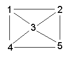

# video
https://youtu.be/tJddlDKJjmY

# Slides
---

PROLOG for Programmers Introduction (in PROLOG)

---

using: https://www.cpp.edu/~jrfisher/www/prolog_tutorial/2_15.html

---

Declarative <== Relational

PROLOG == Relational

miniKanren == Relational

---




---

**factbase**
```
edge(1,2).
edge(1,4).
edge(1,3).
edge(2,3).
edge(2,5).
edge(3,4).
edge(3,5).
edge(4,5).
```
---
**basic relation**
```
connected(X,Y) :- edge(X,Y).
connected(X,Y) :- edge(Y,X).
```

---
**alternate basic relation**
```
connected(X,Y) :- edge(X,Y) ; edge(Y,X).
```

---

**inferring connections**

---

**Divide and Conquer**

---

**do-it style**

---

**top level**
```
path(A,B,Path) :- BasicPath = [A], inferPath(A,B,BasicPath,Path).
```

---

**base case**
```
inferPath(A,B,P,ResultPath) :- connected(A,B), ResultPath = [B|P].
```

---

**recursive case**
```
inferPath(A,B,PriorPath,ResultPath) :-
       connected(A,C),           
       C \== B,
       \+member(C,PriorPath),
       NewPath = [ C | PriorPath ],
       inferPath(C,B,NewPath,ResultPath).
```

---

PROLOGify - Better Relations

---

**top level**
```
path(A,B,Path) :- BasicPath = [A], inferPath(A,B,BasicPath,Path).
```
->
```
path(A,B,Path) :- inferPath(A,B,[A],Path).
```

---

**base case**
```
inferPath(A,B,P,ResultPath) :- connected(A,B), ResultPath = [B|P].
```
->
```
inferPath(A,B,P,[B|P]) :- connected(A,B).
```

---

**recursive case**
```
inferPath(A,B,PriorPath,ResultPath) :-
       connected(A,C),           
       C \== B,
       \+member(C,PriorPath),
       NewPath = [ C | PriorPath ],
       inferPath(C,B,NewPath,ResultPath).
```
->
```
inferPath(A,B,Visited,Path) :-
       connected(A,C),           
       C \== B,
       \+member(C,Visited),
       inferPath(C,B,[C|Visited],Path).
```

---
       

**SWIPL at command line**
```
swipl
  ?- consult(path).
  ?- path(5,1,R).
  ?- halt.
```
  
---

**SWIPL in Bash script**
```
  #!/bin/bash
  swipl -q \
      -g 'consult(path)' \
      -g 'use_module(library(http/json))' \
      -g 'bagof(R,path(5,1,R),B),write(B),nl.' \
      -g 'halt'
```
	  
---
	  
**SWIPL with JSON**
```
#!/bin/bash
  swipl -q \
      -g 'consult(path)' \
      -g 'use_module(library(http/json))' \
      -g 'bagof(R,path(5,1,R),B),json_write(user_output,B),nl.' \
      -g 'halt'
```

# Transcript
 I am gonna do a quick introduction of PROLOG for programmers using JR Fisher's tutorial. It's on this webpage here. One thing to notice is that we strive to do declarative programming. One form of declarative is relational programming. PROLOG was one of the first attempts at relational programming.

Mini kran is the current manifestation of relational program. I happen to be using eax org mode, and I'm gonna probably use a sw s w I PROLOG, although I've used G PROLOG a lot also. Let's have a look at the figure. It's Listed in that article it's basically five nodes forming a network, and there's connections between the nodes in, the various ways that are shown on this diagram.

The diagram shown can be described as a PROLOG da fact base. In PROLOG, we would say that there's an edge from one to two. The period acts like a semicolon in many languages. These are all relations. They're basically just straight out con fact constants, and if you look through the rest of it, you can get the idea of what's going on here.

If we look at the fact base, we see that there's an edge from one to two, but it doesn't say that two is connected to one. We can add a basic relation that, that shows this relationship that two nodes are connected. If there's an edge between X and Y or if there's an edge between y and.

In PROLOG, we can write this basic relation a different way, which is to use a semicolon operator. So basically we're saying connected is edge of X, Y or, or.  edge of Yx in PROLOG, it is conventional to put all the or terms separated as, separate relations or in this form where, there's a semicolon between them and type relations are done with commas and we'll see that.

We can infer further connections by adding PROLOG rules, using guess what? Divide and conquer. There's the programmer, do it kind of style and the pro. Then we can prolog, gify it and turn the relations, the code into better relations.

Any attempt to solve this problem breaks down into two main problems and one envelope I call the envelope around the whole thing, the top level, there's a base case that says how we know when we're finished and the recursive case.

We'll start looking at the top level case, basically having a relation that signifies the path between A and B. And we write the path into a result called path. Fundamentally, every path starts out with square brackets in PROLOG mean list. So we the basic path always has a in it since that's where we start.

And then we infer new paths between A and B. As we go.

If we look at the base case it says that I, I. The, most basic level. If there's something that satisfies the connection between A and B, then we're done and we just glue the result B onto the path. This is the way you write list cons and B onto the front of B, and then we're putting it into the variable called result path in the recursive case.

We look for connections between A and B. We keep a prior path around and we keep the result path. We invent a, new node and we call it c. And we look for a connection between if, A and C are connected and C is not equal to the final result, B, that we want and C is not a member of the prior path, then we cons C onto the prior path, creating a new path, and then we recur.

We try to find connections between c and b on the, and we produce a resulting path and we keep a prior path around. Now we'll look at how to write these relations in better PROLOG form. We'll look at the top level, the base case, and the recursive case separately. Now looking at the top level in PROLOG form, we take the do it style and rewrite it in PROLOG this way.

Programmers are used to writing a function signature, followed by. How to get there, how to do it. Whereas in PROLOG, everything is a relation, and that's not actually a function signature. It's just a shorthand for whatever is on the right hand side. So the left hand side really is just a, is a truism.

It says when the PROLOG run is finished, then this will be true. And here's how we, and here's how we infer that things are true in this case. What we, don't need a Temporary variable that assigns the list of containing only a into a temporary variable called Basic Path. We can just stick it directly into the relation and get rid of this.

In fact, the equal business in, PROLOG needs a little bit more of looking at. I won't dig into it, but try not to use it.

Likewise, the base case in PROLOG folds our original code, which kind of looked like this, with an equal sign into a relation that says everything in one fell swoop that that we can infer the path from A to B and the result is b. Associate B put onto the result path, resulting path or put on, put in the resulting path is the previous path with the result.

Put B put onto it only if A and B are connected.  again, this doesn't look like what programmers are used to because we're, showing things that programmers think of as do it code causing things on the left hand side. In fact, this is still a relationship that shows that infer path is true and we had a prior path and that the, the.

thing we called the resulting path is broken up into a head and a tail. A head where the head is the, new, the node and the tail is the previous path. And when we continue writing it this way, we can actually do more, more interesting things. Like we don't actually have to supply A and B.

We can ask given a.  what are the po given a path and a prior path? What were the previous, what were the A and Bs that satisfied that relationship? Likewise, the recursive case of Chronification takes the the old style and writes it as a single relation that's recursive. And here we've gotten rid of.

Temporary variables like this. I've in this particular case, I took prior path and renamed it to visited which makes more sense to me in the final result. And we've dropped from five lines to four of again, this side is the abbreviation for these four lines. So if, we can show that these four lines are true, then this relation.

Is true.  and PROLOG will find all of the matches for that relation. And in PROLOG, what we'll see is we can actually run some of this code in PROLOG. And we will see that it backtracks over. The code gives us one solution. If we give it a semicolon, it gives us another solution. If we give it another semi and keep doing that until it runs out of solutions, then it stops giving us solutions.

I've taken all of the code we've written so far and the facts and put them into a single file called Path pl. The the extensions, pl and pl are the, ones favored by the two PROLOGs that I use. S SWI PROLOG, and G PROLOG. Now, I'll take this. PROLOG file and load it into PROLOG. So we'll switch to the terminal, we'll run the SW PROLOG and to load a file, I use the command called consult, and we don't need to give it a path name.

We do have to remember the dot. And that loads the.

We can qu do simple queries on the fact base. For example, we can ask to see if edge, if there's an edge between one and two. And it, and now I'm gonna, it says true. There was, I'm gonna put in a semicolon and then it'll say there are no more edges between one and.  I can try an edge between two and one, and that says there isn't any.

There aren't any.

Now we can use the Most basic query that we had, the basic relation, which is connected two and one, and that returns true, you can say connected one and two, which should be true, and it is. Now we can try something more interesting. We can ask for what is the path between one five and we'll put the result in something called p.

And it says that you can get there going from five to one, to two to one, or from five to three to two to one, or five to four to three to two to one, five to four to one, five to three, to four to one, five to 3, 4, 1, 5, 3, 1, 5, 4, 3, 1, 5, 2, 3, 1. And that's,

Note that in PROLOG variables, logic variables are always capitalized. Everything else is lowercase. So if I say path one comma five, big R result, then it has no problem finding it. If I say path one, Lower case result, then it fails immediately. I can also put some of these commands into bash scripts.

I'll halt is the way to quit PROLOG. I go up here and I've I think I've created a file called G Path for running, g PROLOG. If I run that, Slash g then it'll load the, it'll consult the file path pl and then it'll, and then it'll leave me ready to do a query so I can do one five capital R, and then it'll give me the results halt.

I can do the same for SW PROLOG. I've created a bash file called SW Path Bash, and it it's got a slightly different command line syntax, and we'll try running it. Change this slash. And it leaves me ready to do a query. It's, consulted the file called Path pl and it relieves me ready to do a query like that. And same thing. Halt period. Halt is the way you finish. And then you all have to remember the period.

Swipe PROLOG has the minus Q modifier, so I'll say minus q. I'll do a back slash, which is shell syntax, to continue a line and modify the file. This way. I then run it again, and there it is, ready for me to put in a query.

You can even put -l halt this again, halt. You can put the query in as a further command line argument minus G path five one big R and we can try that. Guess what? It ran the query, but it didn't show us the. Now we'll retry that with rewriting the query to have an output. So we're gonna collect all of the results are of pa of the query path R into a bag called B.

Then we're gonna write b.  onto, stood out, and then we're gonna c cause a new line. And if I got that we should be able to run it. There it is. And I forgot to put the, I can put a halt at the end of that like this minus g halt. Let's try that. And that's the whole query and it finished.

Things get more interesting. If we write out the facts as JSON instead of PROLOG fact base format, I'll make the modifications to the shell script. Here we consult path.pl. We, I've added the line that uses the module called JSON. Then we do the bag of, and instead of calling we call JSON Wright.

This is user. This is stood out, user output in Prologis the bag and the N -l. We've saved it and then we try it again, and there we are. It's output is JSON.
